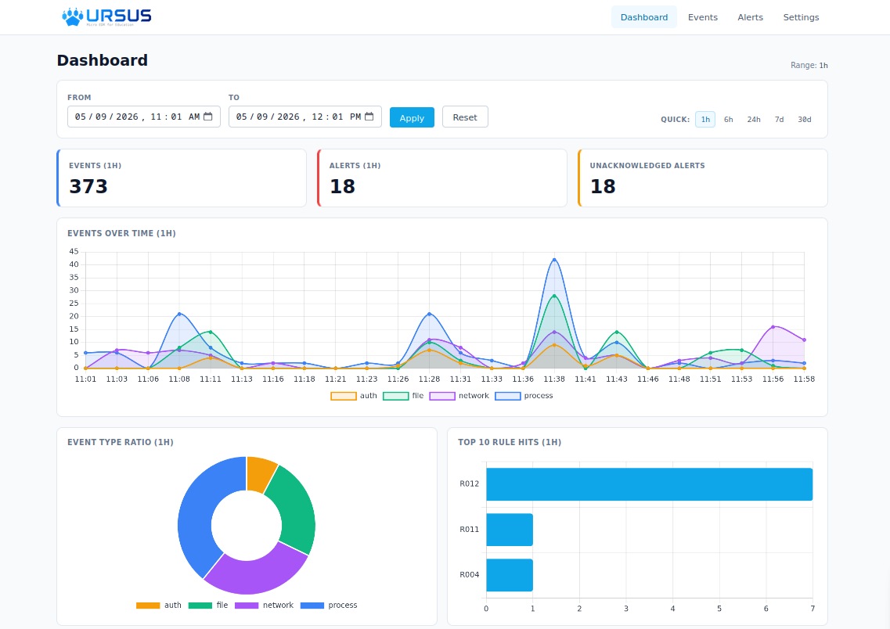

<p align="center">
  
</p>

## URSUS（ウルサス） とは

URSUS は Python で実装されたセキュリティ学習向けの簡素な EDR (Endpoint Detection and Response) です。
EDR が端末上でどのように動作し、どのように振る舞うのかを明確にするため、役割ごとに分離された複数のコンポーネントが連動するよう設計されています。

コード全体を読み解くことで Linux におけるイベント収集のアプローチを学ぶことができ、本番環境における EDR の動作を理解するためのヒントを得ることができます。
動作は簡素ながら実際の EDR を模倣しているため、仮想マシン上での検証やハッキング手法の実践を試すための実用ツールとしても使用可能です。

<p align="center">
  
</p>


## クイックスタート

> **前提条件**: Linux OS (Ubuntu / Debian / Arch 等)、Python 3.11 以上、root 権限

```bash
# 1. リポジトリをクローン
git clone https://github.com/akinosora501/ursus-micro-edr.git
cd ursus-micro-edr/

# 2. 実行権限の付与
chmod +x scripts/*.sh

# 3. インストール
sudo ./scripts/install.sh

# 4. 起動
sudo ./scripts/start.sh

# 5. ブラウザでアクセス
# http://127.0.0.1:8080
```

## ドキュメント

URSUS の完全なドキュメントは **[GitHub Pages](https://akinosora501.github.io/ursus-micro-edr/)** で公開しています。


## 既知のバグ・課題
- アラートのクロージング機能は未実装です
- プロセスツリーの構築ロジックが不完全なため、現状は疑似的なツリー情報が出力されます


## 注意事項

URSUS は EDR の性質上、カーネルに近い領域 (netlink ソケット、inotify 等) で動作するコンポーネントを含みます。
潜在的なバグにより稼働中のシステムに悪影響を与える可能性があるため、**必ず仮想マシン上でご使用ください**。
本番環境や重要なシステムでの使用は推奨しません。また、開発者は、本ソフトウェアの使用によって生じた直接的・間接的・偶発的な損害について、一切の責任を負いません。

詳細は **[免責事項](https://akinosora501.github.io/ursus-micro-edr/disclaimer.html)** をご確認ください。


## ライセンス

[MIT License](LICENSE)

なお、本ソフトウェアでは以下のサードパーティライブラリを使用しています。
- Tailwind CSS (MIT License)
- Chart.js (MIT License)
